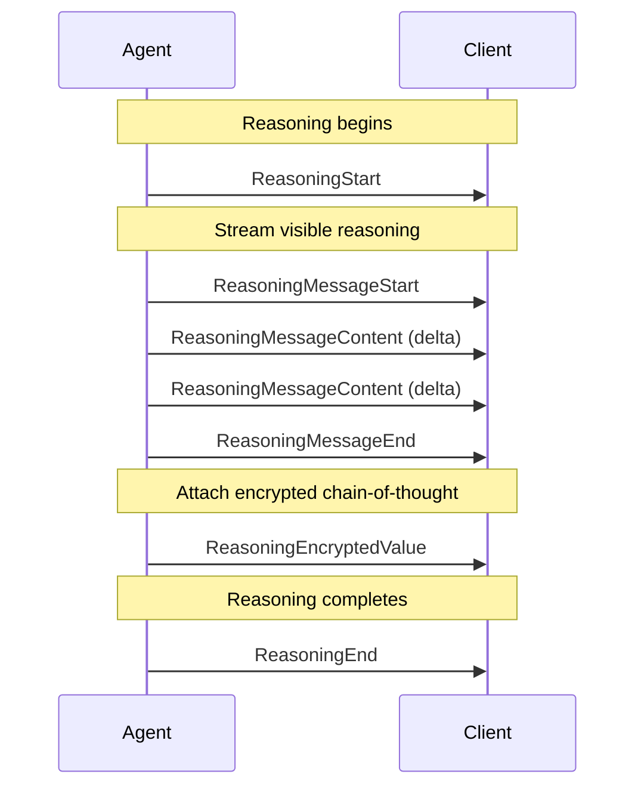

# Reasoning

AG-UI provides first-class support for LLM reasoning, enabling chain-of-thought
visibility while maintaining privacy and state continuity across conversation
turns.

## Overview

Modern LLMs increasingly use chain-of-thought reasoning to improve response
quality. AG-UI's reasoning support addresses three key challenges:

- **Reasoning visibility**: Surface reasoning signals (e.g., summaries) to users
  without exposing raw chain-of-thought
- **State continuity**: Maintain reasoning context across turns using encrypted
  reasoning items, even under `store:false` or zero data retention (ZDR)
  policies
- **Privacy compliance**: Support enterprise privacy requirements while
  preserving reasoning capabilities

## ReasoningMessage

The `ReasoningMessage` type represents reasoning content in the message history:

```typescript
interface ReasoningMessage {
  id: string
  role: "reasoning"
  content: string // Reasoning content (visible to client)
  encryptedValue?: string // Optional encrypted reasoning for state continuity
}
```

| Property         | Type          | Description                                          |
| ---------------- | ------------- | ---------------------------------------------------- |
| `id`             | `string`      | Unique identifier for the reasoning message          |
| `role`           | `"reasoning"` | Message role discriminator                           |
| `content`        | `string`      | Reasoning content visible to the client              |
| `encryptedValue` | `string?`     | Encrypted chain-of-thought blob for state continuity |

Key characteristics:

- **Separate from assistant messages**: Reasoning is kept distinct from final
  responses to avoid polluting conversation history
- **Streamable**: Content arrives via streaming events
- **Optional encryption**: When `encryptedValue` is present, it represents
  encrypted chain-of-thought that the client stores and forwards opaquely

## Reasoning Events

Reasoning events manage the lifecycle of reasoning messages. See
[Events](/concepts/events#reasoning-events) for the complete event reference.

### Event Flow

A typical reasoning flow follows this pattern:



### Event Types

| Event                     | Purpose                                                       |
| ------------------------- | ------------------------------------------------------------- |
| `ReasoningStart`          | Marks beginning of reasoning phase                            |
| `ReasoningMessageStart`   | Begins a streaming reasoning message                          |
| `ReasoningMessageContent` | Delivers reasoning content chunks                             |
| `ReasoningMessageEnd`     | Completes a reasoning message                                 |
| `ReasoningMessageChunk`   | Convenience event that auto-manages message lifecycle         |
| `ReasoningEnd`            | Marks completion of reasoning                                 |
| `ReasoningEncryptedValue` | Attaches encrypted chain-of-thought to a message or tool call |

## Privacy and Compliance

AG-UI reasoning is designed with privacy-first principles:

### Zero Data Retention (ZDR)

For deployments requiring zero data retention:

1. **Encrypted reasoning values** can carry state across turns without storing
   decryptable content on the client
2. The client receives and forwards `encryptedValue` blobs opaquely via
   `ReasoningEncryptedValue` events
3. Only the agent (or authorized backend) can decrypt the reasoning content

### Visibility Control

Agents control what reasoning is visible to users:

- **Full visibility**: Stream the complete chain-of-thought via
  `ReasoningMessageContent` events
- **Summary only**: Emit a condensed summary while attaching detailed reasoning
  as encrypted values
- **Hidden**: Use only `ReasoningEncryptedValue` events with no visible
  streaming

### Compliance Considerations

| Requirement             | Solution                                                                            |
| ----------------------- | ----------------------------------------------------------------------------------- |
| GDPR right to erasure   | Encrypted content can be discarded without losing reasoning capability              |
| SOC 2 data handling     | Reasoning content never stored in plaintext on client                               |
| HIPAA minimum necessary | Only summaries exposed; detailed reasoning stays encrypted                          |
| Audit logging           | `ReasoningStart`/`ReasoningEnd` events provide audit trail without content exposure |

## Example Implementations

### Basic Reasoning Flow

A simple implementation showing visible reasoning:

```typescript
// Agent emits reasoning start
yield {
  type: "REASONING_START",
  messageId: "reasoning-001",
}

// Stream visible reasoning content
yield {
  type: "REASONING_MESSAGE_START",
  messageId: "msg-123",
  role: "assistant",
}

yield {
  type: "REASONING_MESSAGE_CONTENT",
  messageId: "msg-123",
  delta: "Let me think through this step by step. ",
}

yield {
  type: "REASONING_MESSAGE_CONTENT",
  messageId: "msg-123",
  delta: "First, I need to analyze the requirements...",
}

yield {
  type: "REASONING_MESSAGE_END",
  messageId: "msg-123",
}

// End reasoning
yield {
  type: "REASONING_END",
  messageId: "reasoning-001",
}
```

### Encrypted Content for State Continuity

When maintaining reasoning state across turns without exposing content, use the
`ReasoningEncryptedValue` event to attach encrypted chain-of-thought to messages
or tool calls:

```typescript
// Agent emits reasoning start
yield {
  type: "REASONING_START",
  messageId: "reasoning-002",
}

// Stream a visible summary for the user
yield {
  type: "REASONING_MESSAGE_START",
  messageId: "msg-456",
  role: "assistant",
}

yield {
  type: "REASONING_MESSAGE_CONTENT",
  messageId: "msg-456",
  delta: "Analyzing your request...",
}

yield {
  type: "REASONING_MESSAGE_END",
  messageId: "msg-456",
}

// Attach encrypted chain-of-thought to the reasoning message
yield {
  type: "REASONING_ENCRYPTED_VALUE",
  subtype: "message",
  entityId: "msg-456",
  encryptedValue: "eyJhbGciOiJBMjU2R0NNIiwiZW5jIjoiQTI1NkdDTSJ9...",
}

yield {
  type: "REASONING_END",
  messageId: "reasoning-002",
}

// On subsequent turns, client sends back the message with encryptedValue
// which the agent can decrypt to restore reasoning context
```

### Attaching Encrypted Reasoning to Tool Calls

You can also attach encrypted reasoning to tool calls to capture why the agent
chose specific arguments or how it interpreted results:

```typescript
// Tool call with encrypted reasoning
yield {
  type: "TOOL_CALL_START",
  toolCallId: "tool-123",
  toolCallName: "search_database",
  parentMessageId: "msg-789",
}

yield {
  type: "TOOL_CALL_ARGS",
  toolCallId: "tool-123",
  delta: '{"query": "user preferences"}',
}

yield {
  type: "TOOL_CALL_END",
  toolCallId: "tool-123",
}

// Attach encrypted reasoning explaining why this tool was called
yield {
  type: "REASONING_ENCRYPTED_VALUE",
  subtype: "tool-call",
  entityId: "tool-123",
  encryptedValue: "encrypted-reasoning-about-tool-selection...",
}
```

### ZDR-Compliant Implementation

For zero data retention scenarios:

```typescript
// Server-side: encrypt reasoning before sending
const encryptedReasoning = await encrypt(detailedChainOfThought, secretKey)

yield {
  type: "REASONING_START",
  messageId: "reasoning-003",
}

// Only emit a high-level summary to the client
yield {
  type: "REASONING_MESSAGE_CHUNK",
  messageId: "summary-001",
  delta: "Processing your request securely...",
}

yield {
  type: "REASONING_MESSAGE_CHUNK",
  messageId: "summary-001",
  delta: "", // Empty delta closes the message
}

// Attach the encrypted chain-of-thought
yield {
  type: "REASONING_ENCRYPTED_VALUE",
  subtype: "message",
  entityId: "summary-001",
  encryptedValue: encryptedReasoning,
}

yield {
  type: "REASONING_END",
  messageId: "reasoning-003",
}

// Client stores only:
// - The encrypted blob (cannot decrypt)
// - The summary text (no sensitive details)
// Full reasoning is never persisted in plaintext
```

### Using the Convenience Chunk Event

The `ReasoningMessageChunk` event simplifies implementation by auto-managing
message lifecycle:

```typescript
// First chunk with messageId starts the message automatically
yield {
  type: "REASONING_MESSAGE_CHUNK",
  messageId: "msg-789",
  delta: "Analyzing the problem space...",
}

// Subsequent chunks continue the stream
yield {
  type: "REASONING_MESSAGE_CHUNK",
  messageId: "msg-789",
  delta: " Considering multiple approaches...",
}

// Empty delta (or next non-reasoning event) closes automatically
yield {
  type: "REASONING_MESSAGE_CHUNK",
  messageId: "msg-789",
  delta: "",
}
```

## Client Integration

### Handling Reasoning Events

```typescript
import { EventType, type BaseEvent } from "@ag-ui/core"

function handleEvent(event: BaseEvent) {
  switch (event.type) {
    case EventType.REASONING_START:
      // Initialize reasoning UI (e.g., "thinking" indicator)
      console.log("Agent is reasoning...")
      break

    case EventType.REASONING_MESSAGE_CONTENT:
      // Append visible reasoning to UI
      appendReasoningText(event.messageId, event.delta)
      break

    case EventType.REASONING_ENCRYPTED_VALUE:
      // Store encrypted value for the referenced entity
      if (event.subtype === "message") {
        storeMessageEncryptedValue(event.entityId, event.encryptedValue)
      } else if (event.subtype === "tool-call") {
        storeToolCallEncryptedValue(event.entityId, event.encryptedValue)
      }
      break

    case EventType.REASONING_END:
      // Finalize reasoning UI
      console.log("Reasoning complete")
      break
  }
}
```

### Passing Encrypted Reasoning Back

When making subsequent requests, include stored encrypted values:

```typescript
const response = await agent.run({
  threadId: "thread-123",
  messages: [
    ...previousMessages,
    {
      id: "reasoning-002",
      role: "reasoning",
      content: "Analyzing your request...", // Visible summary
      encryptedValue: storedEncryptedBlob, // Opaque to client
    },
    {
      id: "user-msg-001",
      role: "user",
      content: "Follow up question...",
    },
  ],
})
```

## Migration from Thinking Events

<Warning>
  The `THINKING_*` events are deprecated and will be removed in version 1.0.0.
  New implementations should use `REASONING_*` events.
</Warning>

### Deprecated Events

The following events are deprecated:

| Deprecated Event                | Replacement                 |
| ------------------------------- | --------------------------- |
| `THINKING_START`                | `REASONING_START`           |
| `THINKING_END`                  | `REASONING_END`             |
| `THINKING_TEXT_MESSAGE_START`   | `REASONING_MESSAGE_START`   |
| `THINKING_TEXT_MESSAGE_CONTENT` | `REASONING_MESSAGE_CONTENT` |
| `THINKING_TEXT_MESSAGE_END`     | `REASONING_MESSAGE_END`     |

### Migration Steps

1. **Update event types**: Replace all `THINKING_*` event types with their
   `REASONING_*` equivalents
2. **Update message types**: Use `ReasoningMessage` with `role: "reasoning"`
   instead of any thinking-specific message types
3. **Add encrypted value support**: Consider using `ReasoningEncryptedValue`
   events for improved privacy compliance
4. **Test thoroughly**: Ensure existing functionality works with the new event
   types

### Example Migration

Before (deprecated):

```typescript
// ❌ Deprecated - do not use
yield { type: "THINKING_START", messageId: "think-001" }
yield { type: "THINKING_TEXT_MESSAGE_START", messageId: "msg-001" }
yield { type: "THINKING_TEXT_MESSAGE_CONTENT", messageId: "msg-001", delta: "..." }
yield { type: "THINKING_TEXT_MESSAGE_END", messageId: "msg-001" }
yield { type: "THINKING_END", messageId: "think-001" }
```

After (current):

```typescript
// ✅ Current implementation
yield { type: "REASONING_START", messageId: "reasoning-001" }
yield { type: "REASONING_MESSAGE_START", messageId: "msg-001", role: "assistant" }
yield { type: "REASONING_MESSAGE_CONTENT", messageId: "msg-001", delta: "..." }
yield { type: "REASONING_MESSAGE_END", messageId: "msg-001" }
yield { type: "REASONING_END", messageId: "reasoning-001" }
```

## Best Practices

1. **Always pair start/end events**: Every `ReasoningStart` should have a
   corresponding `ReasoningEnd`
2. **Use encrypted values for sensitive reasoning**: When chain-of-thought
   contains sensitive information, use `ReasoningEncryptedValue` to attach
   encrypted content to messages or tool calls
3. **Provide user feedback**: Even with encrypted reasoning, emit visible
   summaries so users know the agent is working
4. **Handle missing events gracefully**: Clients should be resilient to
   incomplete event streams
5. **Consider bandwidth**: For very long reasoning chains, consider emitting
   only summaries to reduce data transfer

## Related Documentation

- [Events](/concepts/events#reasoning-events) - Complete event type reference
- [Messages](/concepts/messages#reasoning-messages) - Message type documentation
- [Serialization](/concepts/serialization) - State continuity and lineage
