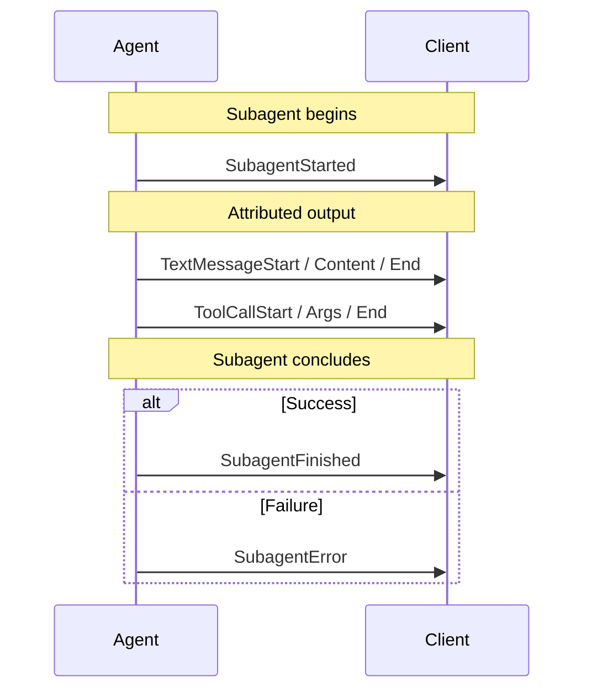

# Subagents

Many agent frameworks let an agent delegate work to child agents — a supervisor
dispatching research tasks, an agents-as-tools pattern where a tool call *is* a
nested agent, or a planner farming out subtasks in parallel.

To a frontend, all of that arrives as one event stream. Without extra
information there is no way to tell which subagent produced a given message, so
three concurrent researchers render as one undifferentiated wall of text.

AG-UI's subagent support solves exactly that problem and nothing more: it
**attributes** each event to the subagent that produced it, and reports when
subagents start and stop. It does not orchestrate, schedule, or define
subagents — that stays entirely with the framework.

## `subagentRunId` identifies an invocation, not a definition

This is the single most important thing to understand, and the easiest thing to
get wrong.

`subagentRunId` is an **opaque handle for one invocation** of a subagent. Run the
same subagent twice and you get two different values. It is not a stable
identifier for a reusable subagent definition, and it is not a name.

The symmetry with the top-level run makes the distinction clearer:

| Top level                            | Subagent                                       |
| ------------------------------------ | ---------------------------------------------- |
| `agentId` — a configured, reusable agent | the subagent's `name` — a reusable subagent type |
| `runId` — one invocation's lifecycle | `subagentRunId` — one nested invocation's lifecycle |

So:

- **Do** key transient UI state — a collapsible group, a spinner, a progress row —
  by `subagentRunId`.
- **Do not** persist anything by `subagentRunId` expecting it to be meaningful on
  a later run, and do not treat two invocations of one subagent as sharing a
  value. Use `name` when you mean "which kind of subagent this is".

<Note>
  This field was called `subagentId` in prerelease builds. It was renamed because
  the old name implied a reusable definition. If you are on a `canary` build that
  still uses `subagentId`, the value has the same meaning — only the name changed.
</Note>

## Lifecycle events

Three events bracket a subagent's activity.

### SubagentStarted

Announces a new subagent invocation and gives it a name a UI can display.

| Property              | Description                                                     |
| --------------------- | --------------------------------------------------------------- |
| `subagentRunId`       | Opaque id for this invocation. Required                          |
| `name`                | The subagent's declared type or name, for display. Required      |
| `description`         | Optional human-readable description                             |
| `parentSubagentRunId` | Optional — the enclosing subagent, when subagents nest           |
| `parentToolCallId`    | Optional — the tool call that spawned this subagent              |
| `parentMessageId`     | Optional — the message that held that tool call                  |

`parentToolCallId` and `parentMessageId` exist for the agents-as-tools pattern.
They let a client correlate a subagent to the call that created it — to render
the subagent's output inside the tool-call card, for instance — without having to
inspect `rawEvent`.

### SubagentFinished

Marks a subagent invocation as complete.

| Property        | Description                                             |
| --------------- | ------------------------------------------------------- |
| `subagentRunId` | Matches the id from `SubagentStarted`. Required          |
| `result`        | Optional completion payload, mirroring `RunFinished.result` |

### SubagentError

Marks a subagent invocation as failed.

| Property        | Description                                    |
| --------------- | ---------------------------------------------- |
| `subagentRunId` | Matches the id from `SubagentStarted`. Required |
| `message`       | Human-readable error message. Required         |
| `code`          | Optional error code                            |

## Attribution

Beyond the lifecycle events, most events can carry an optional `subagentRunId`
saying who produced them.

An event with no `subagentRunId` belongs to the parent agent. Attribution is
additive: a stream that never sets the field behaves exactly as it did before
subagents existed.

**Events that can carry attribution:** the text message family, the tool call
family, activity events, the reasoning family, step events, state events, and
`Raw`/`Custom`.

**Events that cannot:** `RunStarted`, `RunFinished`, `RunError` — these describe
the run as a whole — and `MessagesSnapshot`, which carries attribution
per-message instead, since one snapshot mixes messages from several producers.

### Attribution is provenance, not ownership

This distinction matters most on state events, so it is worth stating plainly.

`StateSnapshot` and `StateDelta` are attributable. Attribution on them records
**which subagent produced the update** — it does not mean the subagent has state
of its own. AG-UI state is run-scoped: there is one state document for the run,
and an attributed snapshot or delta is still applied to that one document. The
tag is provenance you can surface ("the researcher updated the shared
scratchpad"), not a separate scope.

That is exactly the meaning attribution carries on the other standalone events.
Nobody reads an attributed `Custom` event as the subagent having private custom
events, and state is no different.

<Warning>
  There is no such thing as per-subagent state. If you attribute a snapshot
  expecting the parent's state to be left alone, it will not be — the snapshot
  replaces the run's state as any snapshot does. Use a distinct key inside the
  run state if you need to keep subagents' data apart.
</Warning>

Note that a producer is never *obliged* to attribute state. Some do not: the
LangGraph integration, for instance, does not emit state while a subagent is
active, because its state is one shared document and a mid-delegation snapshot
would carry a partial view. That is a reasonable producer-side choice, not a
protocol requirement.

### Attribution transfers to messages

When an attributed event creates a message, the `subagentRunId` transfers onto
that message. This is what lets a rendering layer group a conversation by
subagent without replaying the event stream — the messages themselves carry
their origin, and they keep it across turns and snapshots.

### Tool results carry their own attribution

`ToolCallResult` is attributed independently of the call it answers, and that is
intentional rather than an oversight: the party that *executes* a tool call can
differ from the subagent that *requested* it. A frontend-executed tool, or a
supervisor running a call on a subagent's behalf, both produce a result whose
owner is not the caller. Inheriting the caller's attribution would misreport
those cases, so each result states its own.

## Nesting and concurrency

Subagents nest. `parentSubagentRunId` on `SubagentStarted` links a child to its
enclosing subagent; a subagent with no parent link belongs directly to the run.

Subagents also run **concurrently**, and this is the case that separates a
working implementation from a plausible one. When three subagents stream at once,
their events interleave, and attribution is the only thing that disambiguates
them. In particular:

- Two subagents may have open text messages simultaneously. A client must track
  each independently rather than assuming one open message at a time.
- A subagent's `SubagentFinished` closes only that subagent's own open streams,
  never a sibling's or the parent's.
- A parent may finish before its child. `parentSubagentRunId` may therefore name
  a subagent that has already finished, which is valid.

## Rules clients enforce

When subagent events are present, a client validating the stream enforces:

- A `subagentRunId` used for attribution names a subagent that has been started.
- `SubagentFinished` and `SubagentError` name a subagent that is currently
  active, and a subagent is not started twice within a run.
- Continuation and close events agree with the owner their entity was created
  under. A text message opened by one subagent cannot be continued by another.
- Every subagent is closed before `RunFinished`.
- State events are not attributed.

Three things are deliberately **not** enforced, because the protocol does not
require them:

- `parentSubagentRunId` need only name a subagent that has been *started*, not
  one still active — a parent legitimately finishes before its child.
- Events attributed to an already-finished subagent are accepted. Continuation
  events carry the tag of the subagent they belong to even after it finishes.
- Closure is required before `RunFinished` only, not before `RunError`. An
  unclosed subagent is the expected shape of an aborted run.

## Compatibility

Subagent support is additive, so a stream that uses it stays valid for consumers
that ignore it — they see an unattributed stream and three event types they can
skip.

For the other direction, where the *agent* predates subagent support, the
TypeScript client inserts a compatibility shim automatically based on the agent's
reported version. It strips `subagentRunId` and drops the lifecycle events, so an
older agent never receives fields it cannot interpret. Nothing is stripped on the
way to the UI.

## Support

| SDK        | Status                                                       |
| ---------- | ------------------------------------------------------------ |
| TypeScript | Events, attribution, verification, subscriber hooks, protobuf |
| Python     | Events and attribution                                       |
| .NET       | Events, attribution, verification, protobuf                  |

The binary protobuf transport carries subagent attribution on both TypeScript
and .NET, generated from the same schema, so a subagent-attributed stream
survives a round trip across languages.

## See also

- [Events](/concepts/events) — the full event catalogue, including the subagent events
- [Messages](/concepts/messages) — how attribution appears on messages
- [State](/concepts/state) — why state is run-scoped
