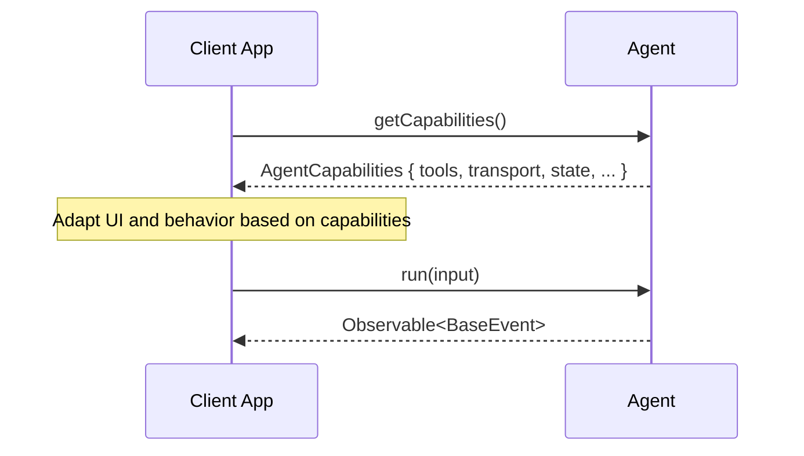

# Agent Capabilities Discovery Proposal

## Summary

### Problem Statement

AG-UI integrations (Mastra, LangGraph, CrewAI, etc.) each support different
features — tools, streaming, structured output, reasoning, multi-agent
coordination, and more. Currently there is no way for a client to discover what
an agent supports at runtime. Clients must guess, hardcode assumptions, or
consult external documentation.

### Motivation

Add a standardized **capability discovery** mechanism to AG-UI so that clients
can query any agent for a typed, categorized snapshot of its current
capabilities. This enables adaptive UIs, smart feature gating, and better
developer experience when working across different agent integrations.

## Status

- **Status**: Draft
- **Author(s)**: AG-UI Team

## Overview

This proposal introduces:

- An optional `getCapabilities()` method on `AbstractAgent`
- A typed `AgentCapabilities` interface with standardized categories
- A convention for `HttpAgent` to discover remote agent capabilities
- An extensibility mechanism via `custom` for integration-specific features



## Design Principles

- **Discovery only** — the agent declares what it can do, no negotiation
- **Dynamic** — returns a live snapshot (add tools, next call reflects them)
- **Optional** — agents that don't implement it return `undefined`
- **Absent = unknown** — only declare what you support, omitted fields mean not
  declared
- **Typed categories + escape hatch** — standardized categories with full
  TypeScript types, plus `custom` for anything else

## Research

Capability patterns were analyzed across 8 frameworks and 2 protocols:

| Framework/Protocol | Capability Pattern | Discovery |
| --- | --- | --- |
| OpenAI Responses API | Per-request parameters | None |
| Anthropic Messages API | Per-request params + beta headers | Opt-in via headers |
| LangGraph | Graph definition + configurable fields | None |
| Mastra | Constructor params + dynamic arguments | None |
| CrewAI | Static constructor params | None |
| AutoGen | Constructor + capability registration | Runtime registration |
| Vercel AI SDK | Constructor + per-call overrides | None |
| Google ADK | Constructor + agent hierarchy | None |
| A2A Protocol | AgentCard at `/.well-known/agent.json` | Static JSON discovery |
| MCP | Bidirectional init handshake | Full negotiation |

**Key findings:**

- **MCP** is the only protocol with true bidirectional capability negotiation
- **A2A** has the best self-description model (discoverable AgentCard)
- Most frameworks use static declaration at construction time
- 50+ unique capabilities were identified across 13 categories
- Capabilities cluster into **binary flags** (streaming: yes/no) and **rich
  declarations** (tool schemas, sub-agent lists)

This design takes inspiration from A2A's AgentCard and MCP's tool discovery, but
keeps it simpler — no negotiation, no handshake, just a method call.

## Detailed Specification

### AbstractAgent Change

```typescript
export abstract class AbstractAgent {
  // ... existing methods unchanged ...

  /**
   * Returns the agent's current capabilities.
   * Optional — agents that don't implement this return undefined.
   */
  async getCapabilities?(): Promise<AgentCapabilities>
}
```

### AgentCapabilities Root Interface

```typescript
interface AgentCapabilities {
  /** Agent identity and metadata */
  identity?: IdentityCapabilities

  /** Supported transport mechanisms */
  transport?: TransportCapabilities

  /** Tools the agent provides (not client-provided tools) */
  tools?: ToolsCapabilities

  /** Output format support */
  output?: OutputCapabilities

  /** State and memory management */
  state?: StateCapabilities

  /** Multi-agent coordination */
  multiAgent?: MultiAgentCapabilities

  /** Reasoning and thinking support */
  reasoning?: ReasoningCapabilities

  /** Multimodal input/output support */
  multimodal?: MultimodalCapabilities

  /** Execution control and limits */
  execution?: ExecutionCapabilities

  /** Human-in-the-loop support */
  humanInTheLoop?: HumanInTheLoopCapabilities

  /** Integration-specific capabilities */
  custom?: Record<string, unknown>
}
```

### Category Interfaces

#### IdentityCapabilities

```typescript
interface IdentityCapabilities {
  name?: string
  description?: string
  version?: string
  provider?: string
  documentationUrl?: string
  metadata?: Record<string, unknown>
}
```

#### TransportCapabilities

```typescript
interface TransportCapabilities {
  streaming?: boolean
  websocket?: boolean
  httpBinary?: boolean
  pushNotifications?: boolean
  resumable?: boolean
}
```

#### ToolsCapabilities

```typescript
interface ToolsCapabilities {
  /** Whether the agent supports tool calling at all */
  supported?: boolean
  /** Tools the agent itself provides */
  items?: Tool[]
  /** Whether the agent can execute tools in parallel */
  parallelCalls?: boolean
  /** Whether the agent supports client-provided tools */
  clientProvided?: boolean
}
```

The `Tool` type is reused from `@ag-ui/core`, providing full JSON schema
definitions for each tool's parameters.

#### OutputCapabilities

```typescript
interface OutputCapabilities {
  structuredOutput?: boolean
  /** Supported output MIME types (e.g., "text/plain", "application/json") */
  supportedMimeTypes?: string[]
}
```

#### StateCapabilities

```typescript
interface StateCapabilities {
  snapshots?: boolean
  deltas?: boolean
  memory?: boolean
  /** Whether state persists across runs within a thread */
  persistentState?: boolean
}
```

#### MultiAgentCapabilities

```typescript
interface MultiAgentCapabilities {
  supported?: boolean
  delegation?: boolean
  handoffs?: boolean
  /** Sub-agents available (by name/id) */
  subAgents?: Array<{ name: string; description?: string }>
}
```

#### ReasoningCapabilities

```typescript
interface ReasoningCapabilities {
  supported?: boolean
  /** Whether reasoning tokens are streamed to the client */
  streaming?: boolean
  encrypted?: boolean
}
```

#### MultimodalCapabilities

```typescript
interface MultimodalCapabilities {
  imageInput?: boolean
  imageGeneration?: boolean
  audioInput?: boolean
  audioOutput?: boolean
  videoInput?: boolean
  pdfInput?: boolean
  fileInput?: boolean
}
```

#### ExecutionCapabilities

```typescript
interface ExecutionCapabilities {
  codeExecution?: boolean
  sandboxed?: boolean
  maxIterations?: number
  maxExecutionTime?: number
}
```

#### HumanInTheLoopCapabilities

```typescript
interface HumanInTheLoopCapabilities {
  supported?: boolean
  approvals?: boolean
  interventions?: boolean
  feedback?: boolean
}
```

### HttpAgent Convention

For `HttpAgent`, which communicates with remote agents, capabilities are
discovered via a conventional endpoint:

```typescript
interface HttpAgentConfig extends AgentConfig {
  url: string
  headers?: Record<string, string>
  /** Override the capabilities endpoint. Defaults to {url}/capabilities */
  capabilitiesUrl?: string
}

class HttpAgent extends AbstractAgent {
  async getCapabilities(): Promise<AgentCapabilities> {
    const url = this.capabilitiesUrl ?? `${this.url}/capabilities`
    const response = await fetch(url, {
      headers: this.headers,
    })
    return response.json()
  }
}
```

Remote agents expose a `GET /capabilities` endpoint that returns the
`AgentCapabilities` JSON object.

## Implementation Examples

### Integration Implementation

Each integration implements `getCapabilities()` returning only what it supports:

```typescript
class MastraAgent extends AbstractAgent {
  async getCapabilities(): Promise<AgentCapabilities> {
    return {
      identity: {
        name: this.config.agent.name,
        description: this.config.agent.description,
      },
      transport: {
        streaming: true,
      },
      tools: {
        supported: true,
        items: this.config.agent.getTools(),
        clientProvided: true,
      },
      state: {
        snapshots: true,
        deltas: true,
        memory: this.config.agent.hasMemory(),
      },
      multiAgent: {
        supported: true,
        delegation: true,
        subAgents: this.config.agent.getSubAgents().map((a) => ({
          name: a.name,
          description: a.description,
        })),
      },
      reasoning: {
        supported: true,
        streaming: true,
      },
    }
  }
}
```

### Client Consumption

```typescript
const agent = new HttpAgent({ url: "https://my-agent.example.com/api" })

const capabilities = await agent.getCapabilities?.()

if (capabilities?.tools?.supported) {
  console.log(`Agent provides ${capabilities.tools.items?.length} tools`)
}

if (capabilities?.reasoning?.supported) {
  // Show reasoning UI toggle
}

if (capabilities?.humanInTheLoop?.approvals) {
  // Prepare approval UI components
}

if (capabilities?.multiAgent?.subAgents?.length) {
  // Show sub-agent selector
}
```

### Dynamic Capabilities

```typescript
const agent = new MastraAgent(config)

// Initially has 5 tools
let caps = await agent.getCapabilities()
console.log(caps.tools?.items?.length) // 5

// Register more tools at runtime
agent.registerTool(newTool1)
agent.registerTool(newTool2)

// Now reflects 7 tools
caps = await agent.getCapabilities()
console.log(caps.tools?.items?.length) // 7
```

### Custom Capabilities

Integrations can declare custom capabilities beyond the standard categories:

```typescript
class MyCustomAgent extends AbstractAgent {
  async getCapabilities(): Promise<AgentCapabilities> {
    return {
      transport: { streaming: true },
      tools: { supported: true, items: this.tools },
      custom: {
        rateLimit: { maxRequestsPerMinute: 60 },
        billing: { tier: "enterprise", creditsRemaining: 1000 },
        compliance: { gdpr: true, hipaa: false },
      },
    }
  }
}
```

## Use Cases

### Adaptive UI

Clients render UI components based on what the agent actually supports — show a
reasoning panel only if `reasoning.supported` is true, display a tool picker
only if `tools.items` has entries.

### Integration Selection

When multiple agents are available, clients can compare capabilities to select
the best agent for a task — e.g., pick one that supports structured output and
multi-agent delegation.

### Feature Gating

Disable UI features that the connected agent doesn't support, providing clear
feedback instead of runtime errors.

### Agent Marketplaces

Discovery platforms can index agent capabilities to help users find agents that
match their needs.

### Debugging and Observability

Developers can inspect what an agent reports as its capabilities to diagnose
integration issues.

## Implementation Considerations

### Client SDK Changes

TypeScript SDK (`@ag-ui/core` and `@ag-ui/client`):

- New capability type definitions in `@ag-ui/core`
- Optional `getCapabilities?()` method on `AbstractAgent`
- `HttpAgent` implementation with conventional endpoint
- New `capabilitiesUrl` field on `HttpAgentConfig`

Python SDK:

- Pydantic models for capability types
- Optional `get_capabilities()` method on agent base class
- HTTP agent implementation for remote discovery

### Framework Integration

Each integration implements `getCapabilities()` by mapping its internal
configuration to the standardized categories. Only supported features are
declared — absent fields mean the capability is not declared.

### Versioning

New capability categories can be added to `AgentCapabilities` as optional fields
without breaking existing implementations. This is a non-breaking additive
change.

## What Changes

| Component | Change |
| --- | --- |
| `@ag-ui/core` | New capability type definitions |
| `@ag-ui/client` `AbstractAgent` | Optional `getCapabilities?()` method |
| `@ag-ui/client` `HttpAgent` | Implementation hitting `{url}/capabilities` |
| `@ag-ui/client` `HttpAgentConfig` | New optional `capabilitiesUrl` field |
| Integrations | Each implements `getCapabilities()` for their features |

## What Doesn't Change

- `run()` method and `RunAgentInput`
- Event types and event processing pipeline
- Middleware and subscriber systems
- Existing `AgentConfig` (except `HttpAgentConfig` gains one optional field)

## Testing Strategy

- Unit tests for capability type construction and serialization
- Integration tests verifying each integration returns accurate capabilities
- Dynamic capability tests (add/remove tools, verify snapshot updates)
- `HttpAgent` tests with mocked `/capabilities` endpoint
- Type compatibility tests ensuring new types don't break existing consumers

## References

- [AG-UI Events Documentation](/concepts/events)
- [AG-UI State Management](/concepts/state)
- [A2A Protocol AgentCard](https://a2a-protocol.org/latest/specification/)
- [MCP Capabilities Negotiation](https://modelcontextprotocol.io/docs/develop/build-server)
