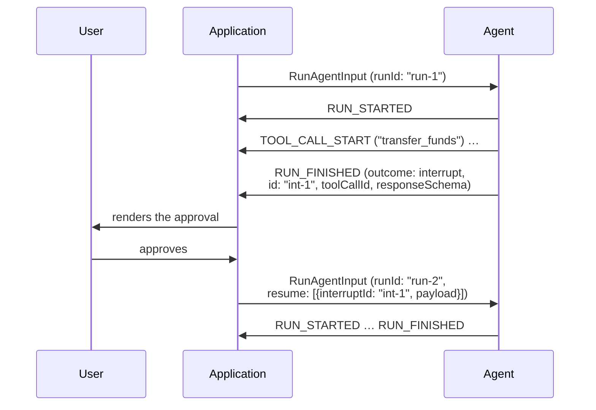

import DraftBanner from "/snippets/spec-draft-banner.mdx";

<DraftBanner />

A run sometimes needs something only the outside world can give it — an
approval, a credential, a choice. The protocol has no mid-run channel from the
consumer, so the run does not wait: it ends, saying what it is waiting for, and
the run that continues from it carries the answers.

## Interrupting

A run that needs outside input ends with `RUN_FINISHED` whose `outcome` is the
interrupt outcome, carrying one or more `Interrupt` objects — at least one,
because an interrupt outcome with nothing to answer would leave a consumer
with nothing to do.

- A producer MUST NOT report an interrupted run as success: the interrupt
  outcome is the only conforming way to end a run that stopped to *ask* —
  where the producer names what it is waiting for and resume entries answer
  it. A run that stopped by calling a
  [frontend tool](/spec/draft/events/tool-calls#frontend-tools) is the other,
  ordinary path: it finishes as success and the answer rides the next input's
  messages.
- Each interrupt's `id` MUST be unique within the run; a resume entry answers
  it by this id.
- An interrupt's `reason` is an open string — the protocol does not attempt to
  classify every reason an agent might need input. `message` is a
  human-readable prompt for whoever answers; `toolCallId` names the tool call
  an approval concerns; `responseSchema` describes the answer's expected shape,
  carried opaquely so a consumer can build a form for it.
- An interrupt raised inside a subagent MAY carry that subagent's
  `subagentRunId`; the [subagent rules](/spec/draft/events/subagents) govern
  attribution and the suspended outcome that accompanies it.

An interrupted run is a closed run. Everything the
[run lifecycle](/spec/draft/events/lifecycle) says about a closed run applies —
including the one late arrival it admits, a `RUN_ERROR` reporting a failure
that surfaced after the close — and continuing means a new run.

## Resuming

The run that continues carries its answers in the input's `resume` list, one
`ResumeEntry` per interrupt answered:

- Each entry's `interruptId` MUST name an interrupt from the run being
  continued — the most recent interrupted run on the thread.
- An entry's `status` says whether the interrupt was answered or abandoned;
  `payload` carries the answer the agent asked for, any JSON value; `metadata`
  is envelope information about the response, not part of the answer.
- The resume list MUST cover every interrupt of the run being continued: each
  one answered, or explicitly abandoned by an entry with the abandoned status.
  Omission is not abandonment — a consumer MUST NOT silently continue past an
  interrupt it has no entry for, and a resuming input that leaves one
  uncovered is rejected before the run starts. What an abandoned interrupt
  means for the agent's work is the producer's business.
- `expiresAt` is deliberately format-unconstrained, so *whether* an interrupt
  has expired is the judging consumer's own reading of it — the reference
  reads it as a date and treats now-or-earlier as expired. The rule attaches
  to the judgment, not to a parse the schema refuses to specify: an interrupt
  the consumer judges expired can no longer be *answered* — a resume entry
  resolving it is rejected before the run starts. It can still be — and,
  coverage being mandatory, must be — abandoned, which is how a thread moves
  past an interrupt nobody answered in time.
- Thread and state continuity hold across the gap: the resuming run carries the
  same `threadId`, the accumulated messages, and the state the interrupted run
  left behind, exactly as any [sequential run](/spec/draft/events/lifecycle)
  does.

A producer receiving resume entries treats them as the answers it stopped for.
An entry naming an interrupt the producer does not recognise violates the
consumer's rule above; this sentence is the producer's error handling for it,
not permission to send it: the run SHOULD proceed without the entry, and the
producer SHOULD surface a warning rather than fail a run over an answer it
never asked for.

## Message Flow

## Data Types

[`RunFinishedInterruptOutcome`](/spec/draft/schema#runfinishedinterruptoutcome), [`Interrupt`](/spec/draft/schema#interrupt) and [`ResumeEntry`](/spec/draft/schema#resumeentry) are defined by the
[schema reference](/spec/draft/schema). `expiresAt`, when present, conventionally
carries an ISO 8601 timestamp; the schema deliberately does not constrain its
format.

## Error Handling

A success outcome carrying interrupts is a contradiction the schema already
rejects — the success outcome is closed. A resume list on a run that does not
continue an interrupted run answers nothing; producers treat its entries as
unrecognised, as above.
