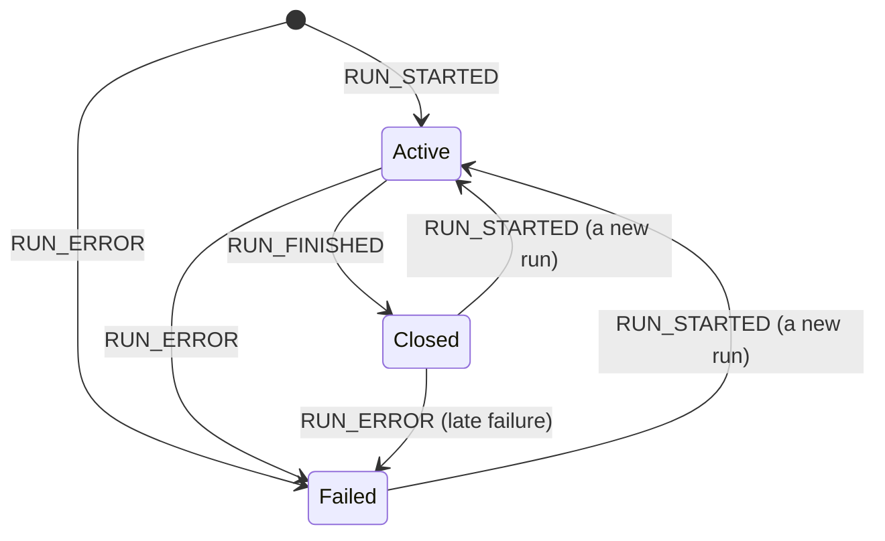

import DraftBanner from "/snippets/spec-draft-banner.mdx";

<DraftBanner />

A consumer sends a [`RunAgentInput`](/spec/draft/basic/run-input); a producer
answers with a stream of events carrying one or more runs — the requested run,
possibly preceded by replayed history. This page states when a run begins and
ends and what those boundaries mean; the ordering rules *inside* a run belong
to the [event patterns](/spec/draft/basic/patterns).

## The run

A stream MUST begin with `RUN_STARTED` or `RUN_ERROR`. A producer MUST NOT emit
any other event first, and a consumer MUST treat a stream that opens with
anything else as a protocol violation. `RUN_ERROR` is admitted first because a
run can fail before it begins — a transport that cannot reach the agent has a
failure to report and no run to report it against.

### `RUN_STARTED`

Opens the run. It carries the run's identifiers, and MAY echo the input the
run was started from, so a consumer that did not make the request can still
see what the agent was asked. `parentRunId` names the run that spawned this
one,
when an agent invokes another agent as a separate run rather than as a
[subagent](/spec/draft/events/subagents) within one.

### `RUN_FINISHED`

Closes a run that did not fail, and reports how it ended:

- Its `outcome` distinguishes a run that completed from one interrupted
  awaiting outside input; an absent outcome means success. The interrupt
  outcome and what follows it are specified in
  [Interrupts and Resume](/spec/draft/basic/patterns/interrupt-resume).
- A producer MUST NOT send an outcome value the schema does not describe.
- `result` is OPTIONAL and carries the run's return value, if it has one.
- `usage` is OPTIONAL and reports token usage, one entry per provider and
  model. A consumer that only wants totals sums across the entries.

An outcome a consumer does not recognise is unrecognised material like any
other, and is stripped on the same terms as the rest. Stripping an optional
field leaves it absent, and an absent outcome means success — so a consumer is
not required to tell a run that completed from one that ended for a reason
named after that consumer shipped.

<Note>
  This bounds how far the outcome set can usefully grow. A terminal state added
  in a later version reaches an older consumer as a successful run, so a version
  that needs older consumers to *notice* a new way of ending cannot say so
  through `outcome` alone — it needs a carrier those consumers already treat as
  significant.
</Note>

### `RUN_ERROR`

Ends a run that failed. `message` says what went wrong, for a person to read;
`code` is OPTIONAL and machine-readable, an open string the protocol defines no
vocabulary for; `usage` MAY report tokens accrued before the failure.

### After a run closes

A run ends with `RUN_FINISHED` or `RUN_ERROR`, after which it is closed. Once a
run has closed:

- A producer MUST NOT emit any further event for that run, other than the two
  named below.
- A producer MAY emit `RUN_STARTED` to begin a new run on the same stream.
- A producer MAY emit `RUN_ERROR` after `RUN_FINISHED`, reporting a failure
  that surfaced after the run reported success — a transport error while
  flushing, say. A consumer MUST treat the run as failed in that case.
- A producer MUST NOT emit anything after `RUN_ERROR` except `RUN_STARTED`.

A consumer MUST reject any other event that arrives after a run has closed.

### Several runs on one stream

A single stream MAY carry several runs in sequence — a replayed thread is the
common case. A producer MUST close the current run before opening the next: a
`RUN_STARTED` while a run is still active is a violation.

Across runs within a stream, messages accumulate and
[state](/spec/draft/events/state) persists unless an event replaces it. A
producer restating history — a replayed thread whose material the consumer's
input already carried — MUST restate it as snapshots: `MESSAGES_SNAPSHOT`
reconciles by id and `STATE_SNAPSHOT` replaces, so a restatement the consumer
already holds is idempotent. Re-streaming a message the consumer already has
appends to it rather than restating it, which is why the streaming triads are
for new material only.

Run-scoped tracking — open messages, open tool calls, open steps, active
subagents — does not cross the boundary: `RUN_FINISHED` requires everything the
run opened to be closed already, and `RUN_ERROR` ends whatever was still open
along with the run. A new run starts with nothing open.

## Steps

Steps mark a run's phases, for a UI that shows progress. `STEP_STARTED` opens a
step and `STEP_FINISHED` closes it, matched by `stepName`.

- A producer MUST NOT open a step whose name is already open, and MUST NOT
  finish a step that was never opened.
- Every step a producer opens MUST be closed before the run finishes.
- Steps MAY overlap each other and anything else in the run; a step is a label
  over a span of the stream, not a container.

## Data Types

The event shapes are defined by the [schema reference](/spec/draft/schema):
[`RunStartedEvent`](/spec/draft/schema#runstartedevent), [`RunFinishedEvent`](/spec/draft/schema#runfinishedevent) (with [`RunFinishedOutcome`](/spec/draft/schema#runfinishedoutcome)),
[`RunErrorEvent`](/spec/draft/schema#runerrorevent), [`StepStartedEvent`](/spec/draft/schema#stepstartedevent), [`StepFinishedEvent`](/spec/draft/schema#stepfinishedevent), and [`TokenUsage`](/spec/draft/schema#tokenusage).

## Error Handling

Everything on this page a producer MUST NOT do is fatal for the run when a
consumer detects it: an event before `RUN_STARTED`, an event after close other
than the two admitted, a nested `RUN_STARTED`, an unbalanced step, or anything
still open at `RUN_FINISHED`. A failed run keeps everything it delivered before
failing — `RUN_ERROR` says the run did not complete, not that its events did
not happen.
