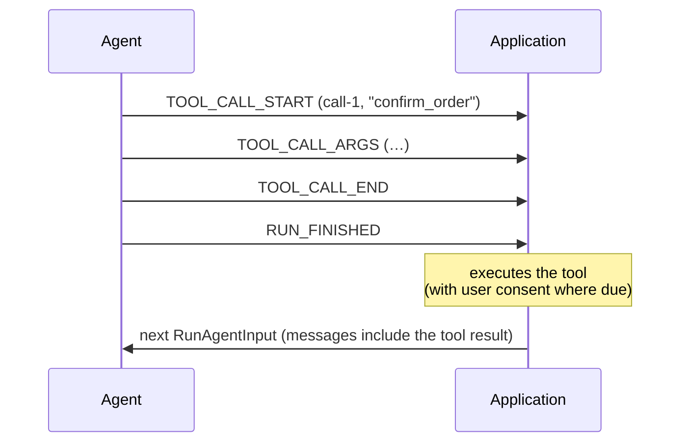

import DraftBanner from "/snippets/spec-draft-banner.mdx";

<DraftBanner />

A tool call is the agent asking for something to be done. When the tool is one
the application advertised in its [run input](/spec/draft/basic/run-input), the
application executes it — which makes tool calls the protocol's
human-in-the-loop core: the agent proposes, the application disposes.

## User Interaction Model

Applications typically surface a tool call as it streams — a card naming the
tool, arguments filling in — and, for side-effectful tools, ask the user before
executing. The protocol does not mandate any particular interaction model, but
see [Security Considerations](#security-considerations) below.

## Events

Tool calls follow the [streaming pattern](/spec/draft/basic/patterns/streaming),
matched by `toolCallId`.

### `TOOL_CALL_START`

Opens a call.

```json
{
  "type": "TOOL_CALL_START",
  "toolCallId": "call-1",
  "toolCallName": "search",
  "parentMessageId": "msg-1"
}
```

- `toolCallName` names the tool being called.
- `parentMessageId` is OPTIONAL and attaches the call to the assistant message
  that carries it. When the parent message is attributed to a subagent, the
  call MUST agree with that attribution — a tool call belongs to the message
  that carries it (see [Subagents](/spec/draft/events/subagents)).

### `TOOL_CALL_ARGS`

Extends the open call. `delta` carries the next piece of the call's arguments;
the concatenated deltas form the call's argument text, conventionally a JSON
document — but the protocol carries it as text and does not validate it, which
is deliberate: providers emit malformed argument strings, and the application
deciding what to do with one beats the transport killing the run.

A consumer MUST NOT act on the arguments before `TOOL_CALL_END`: until the call
closes, the text is a prefix of whatever the producer is sending, not the
thing itself.

### `TOOL_CALL_END`

Closes the call. The argument text is complete — closing establishes
completeness, not validity. Whoever executes the tool parses it, and what to
do with text that does not parse is the application's decision, not a
protocol violation.

A closed call, like a closed message, MAY be reopened by a new
`TOOL_CALL_START` with the same `toolCallId`, and further arguments append. A
reopening start MUST agree with the call it reopens — the same
`toolCallName`, the same `parentMessageId`, the same owner. A consumer is not
required to detect a disagreement, and unlike a
[reopened text message](/spec/draft/events/text-messages#text_message_end),
the protocol makes no promise about which of the two values a consumer that
missed the violation ends up holding.

### `TOOL_CALL_CHUNK`

The compact spelling. A consumer MUST expand chunks as the
[streaming pattern](/spec/draft/basic/patterns/streaming#the-chunked-form)
specifies: the first chunk MUST carry `toolCallId` and `toolCallName`, and a
continuation repeating `toolCallName` or `parentMessageId` with a conflicting
value is fatal.

### `TOOL_CALL_RESULT`

Carries the result of a call. It is a message in its own right — a tool message
with its own `messageId` — and does not reopen the call it answers.

```json
{
  "type": "TOOL_CALL_RESULT",
  "messageId": "msg-2",
  "toolCallId": "call-1",
  "content": "3 results found."
}
```

A result MAY arrive in the same run as its call — an agent-executed tool — or
never arrive in the stream at all: a client-executed tool's result returns to
the producer as a tool message in the next run's input instead.

## Frontend tools

The `tools` list in [run input](/spec/draft/basic/run-input#tools) is the
application's: the agent proposes a call, the application executes it. The
protocol has no mid-run channel from the consumer, so the answer can only
cross a run boundary — which gives the round-trip its shape:

- A producer that calls a frontend tool MUST NOT answer it: no
  `TOOL_CALL_RESULT`, no fabricated tool message. The result is the
  application's to produce.
- The producer finishes the run with the call unanswered — `RUN_FINISHED`,
  ordinary success outcome — and SHOULD do so promptly once nothing remains
  that does not depend on the result. Several frontend calls MAY be left
  unanswered by one run; the application answers them all at once.
- After the run finishes, the application disposes of each unanswered
  frontend call — executing it, or declining it, with whatever consent its
  own rules require. A thread that continues MUST answer every one of them
  first: the next
  run's `messages` carry a tool message per call, keyed by `toolCallId` — a
  failure is still an answer, as a tool message with `error` set, and a call
  the user declined is answered by saying so. An unanswered call leaves the
  agent mid-thought, and a history with a dangling call is one many models
  reject outright. Abandoning the thread answers nothing and violates
  nothing — the rule binds continuation, the same way resume coverage does.

This is a different round-trip from
[interrupts](/spec/draft/basic/patterns/interrupt-resume): an interrupt is the
producer explicitly stopping to ask, answered by resume entries; a frontend
tool call rides the ordinary message loop, answered by conversation history.

A producer SHOULD call frontend tools only from the advertised list; a call
naming a tool the input did not advertise is not by itself a protocol
violation — what to do with it is the consumer's decision. The producer's own
tools, executed agent-side, never needed advertising and answer in-stream via
`TOOL_CALL_RESULT`.

## Message Flow

A client-executed tool spans two runs:



## Data Types

The event shapes are defined by the [schema reference](/spec/draft/schema):
[`ToolCallStartEvent`](/spec/draft/schema#toolcallstartevent), [`ToolCallArgsEvent`](/spec/draft/schema#toolcallargsevent), [`ToolCallEndEvent`](/spec/draft/schema#toolcallendevent),
[`ToolCallChunkEvent`](/spec/draft/schema#toolcallchunkevent), [`ToolCallResultEvent`](/spec/draft/schema#toolcallresultevent). In conversation history a call
appears as a [`ToolCall`](/spec/draft/schema#toolcall) on an [`AssistantMessage`](/spec/draft/schema#assistantmessage), and a result as a
[`ToolMessage`](/spec/draft/schema#toolmessage). The advertised tools are [`Tool`](/spec/draft/schema#tool) objects on [`RunAgentInput`](/spec/draft/schema#runagentinput).

## Error Handling

The [streaming pattern](/spec/draft/basic/patterns/streaming)'s sequence rules
apply unchanged: continuing or closing a call that is not open, or reopening one
that is, is fatal. A call left open when the run finishes is a violation.

## Security Considerations

Tool calls are the protocol's largest attack surface, because they turn model
output into actions.

- Arguments are model-generated and MUST be treated as untrusted input:
  validated against the tool's declared parameter schema where one was
  advertised, scrutinised like any untrusted payload where none was, and
  never interpolated into shell commands, queries or markup unescaped.
- Applications SHOULD obtain user consent before executing a side-effectful
  tool call, and MUST NOT represent a call as user-approved when it was not.
- Tool results are data from wherever the tool got them. A consumer MUST NOT
  treat text inside a result as protocol material or as instructions carrying
  the user's authority.
- A call naming a tool that was not advertised SHOULD NOT be executed without
  the same scrutiny a new tool would get.
